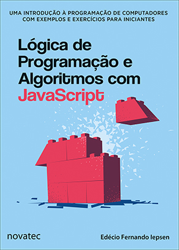

 # Respostas dos exercícios propostos no livro Lógica de Programação e Algoritmos com JavaScript

### Lógica de Programação e Algoritmos com JavaScript
### Autor: Edécio Fernando Iepsen
### Novatec Editora Ltda.
### ISBN: 978-85-7522-656-8

- Pasta com arquivos referentes aos estudos dos exemplos e exercícios contidos/propostos no livro.

- Os exemplos e exercícios propostos no livro podem sem baixados no [link](https://novatec.com.br/livros/logica-programacao-algoritmos-com-javascript/ "Link Novatec").

  

#### Capítulo 1

- [Exercício A](https://rmelojefferson.github.io/jsChallenges/livroEdecioIepsenRespostas/cap1/ex1_a.html)
- [Exercício B](https://rmelojefferson.github.io/jsChallenges/livroEdecioIepsenRespostas/cap1/ex1_b.html)
- [Exercício C](https://rmelojefferson.github.io/jsChallenges/livroEdecioIepsenRespostas/cap1/ex1_c.html)
- [Exercício D](https://rmelojefferson.github.io/jsChallenges/livroEdecioIepsenRespostas/cap1/ex1_d.html)

#### Capítulo 2

- [Exercício A](https://rmelojefferson.github.io/jsChallenges/livroEdecioIepsenRespostas/cap2/ex2_a.html)
- [Exercício B](https://rmelojefferson.github.io/jsChallenges/livroEdecioIepsenRespostas/cap2/ex2_b.html)
- [Exercício C](https://rmelojefferson.github.io/jsChallenges/livroEdecioIepsenRespostas/cap2/ex2_c.html)

#### Capítulo 3

- [Exercício A](https://rmelojefferson.github.io/jsChallenges/livroEdecioIepsenRespostas/cap3/ex3_a.html)
- [Exercício B](https://rmelojefferson.github.io/jsChallenges/livroEdecioIepsenRespostas/cap3/ex3_b.html)
- [Exercício C](https://rmelojefferson.github.io/jsChallenges/livroEdecioIepsenRespostas/cap3/ex3_c.html)
- [Exercício D](https://rmelojefferson.github.io/jsChallenges/livroEdecioIepsenRespostas/cap3/ex3_d.html)

#### Capítulo 4

- [Exercício A](https://rmelojefferson.github.io/jsChallenges/livroEdecioIepsenRespostas/cap4/ex4_a.html)
- [Exercício B](https://rmelojefferson.github.io/jsChallenges/livroEdecioIepsenRespostas/cap4/ex4_b.html)
- [Exercício C](https://rmelojefferson.github.io/jsChallenges/livroEdecioIepsenRespostas/cap4/ex4_c.html)
- [Exercício D](https://rmelojefferson.github.io/jsChallenges/livroEdecioIepsenRespostas/cap4/ex4_d.html)

#### Capítulo 5

- [Exercício A](https://rmelojefferson.github.io/jsChallenges/livroEdecioIepsenRespostas/cap5/ex5_a.html)
- [Exercício B](https://rmelojefferson.github.io/jsChallenges/livroEdecioIepsenRespostas/cap5/ex5_b.html)
- [Exercício C](https://rmelojefferson.github.io/jsChallenges/livroEdecioIepsenRespostas/cap5/ex5_c.html)
- [Exercício D](https://rmelojefferson.github.io/jsChallenges/livroEdecioIepsenRespostas/cap5/ex5_d.html)

#### Capítulo 6

- [Exercício A](https://rmelojefferson.github.io/jsChallenges/livroEdecioIepsenRespostas/cap6/ex6_a.html)
- [Exercício B](https://rmelojefferson.github.io/jsChallenges/livroEdecioIepsenRespostas/cap6/ex6_b.html)
- [Exercício C](https://rmelojefferson.github.io/jsChallenges/livroEdecioIepsenRespostas/cap6/ex6_c.html)
- [Exercício D](https://rmelojefferson.github.io/jsChallenges/livroEdecioIepsenRespostas/cap6/ex6_d.html)

#### Capítulo 7

- [Exercício A](https://rmelojefferson.github.io/jsChallenges/livroEdecioIepsenRespostas/cap7/ex7_a.html)
- [Exercício B](https://rmelojefferson.github.io/jsChallenges/livroEdecioIepsenRespostas/cap7/ex7_b.html)
- [Exercício C](https://rmelojefferson.github.io/jsChallenges/livroEdecioIepsenRespostas/cap7/ex7_c.html)

#### Capítulo 8

- [Exercício A](https://rmelojefferson.github.io/jsChallenges/livroEdecioIepsenRespostas/cap8/ex8_a.html)
- [Exercício B](https://rmelojefferson.github.io/jsChallenges/livroEdecioIepsenRespostas/cap8/ex8_b.html)
- [Exercício C](https://rmelojefferson.github.io/jsChallenges/livroEdecioIepsenRespostas/cap8/ex8_c.html)

#### Capítulo 9

- [Exercício A](https://rmelojefferson.github.io/jsChallenges/livroEdecioIepsenRespostas/cap9/ex9_a.html)
