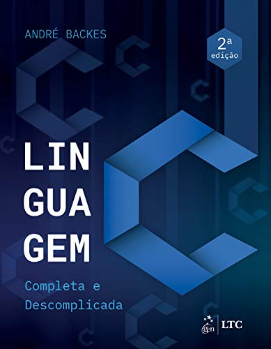

 # Respostas dos exercícios propostos no livro Linguagem C completa e descomplicada

### Linguagem C completa e descomplicada
### Autor: André Backes
### Elsevier Editora Ltda.
### ISBN: 978-85-3528-902-2

- Pasta com arquivos referentes aos exercícios propostos no livro.

### Links de cada exercício feito do livro:

Capítulo 2

- Elabore um programa que escreva as mensagens "Início do programa" e "Fim" na tela, uma em cada linha, usando apenas um comando printf(). [Exercício](https://github.com/rmelojefferson/progChallenges/blob/main/livroLinguageCCompletaDescomplicada/cap02/ex01.c)
- Escreva um programa que leia um número inteiro e depois o imprima. [Exercício](https://github.com/rmelojefferson/progChallenges/blob/main/livroLinguageCCompletaDescomplicada/cap02/ex02.c)
- Escreva um programa que leia um número inteiro e depois imprima a mensagem"Valor lido: seguido do valor inteiro. Use apenas um comando printf(). [Exercício](https://github.com/rmelojefferson/progChallenges/blob/main/livroLinguageCCompletaDescomplicada/cap02/ex03.c)
- Faça um programa que leia um número inteiro e depois o imprima usando o operador "%f". Veja o que aconteceu. [Exercício](https://github.com/rmelojefferson/progChallenges/blob/main/livroLinguageCCompletaDescomplicada/cap02/ex04.c)
- Faça um programa que leia um número do tipo float e depois o imprima usando o operador "%d". Veja o que aconteceu. [Exercício](https://github.com/rmelojefferson/progChallenges/blob/main/livroLinguageCCompletaDescomplicada/cap02/ex05.c)
- Faça um programa que leia um valor do tipo double e depois o imprima na forma de notação científica. [Exercício](https://github.com/rmelojefferson/progChallenges/blob/main/livroLinguageCCompletaDescomplicada/cap02/ex06.c)
- Elabore um programa que leia um caractere e depois o imprima como um valor inteiro. [Exercício](https://github.com/rmelojefferson/progChallenges/blob/main/livroLinguageCCompletaDescomplicada/cap02/ex07.c)
- Faça um programa que leia dois números inteiros e depois os imprima na ordem inversa em que eles foram lidos [Exercício](https://github.com/rmelojefferson/progChallenges/blob/main/livroLinguageCCompletaDescomplicada/cap02/ex08.c)
- Faça um programa que leia dois valores do tipo float. Use um único comando de leitura para isso. Em seguida, imprima os valores lidos na ordem inversa em que eles foram lidos. [Exercício](https://github.com/rmelojefferson/progChallenges/blob/main/livroLinguageCCompletaDescomplicada/cap02/ex09.c)
- Elabore um programa que solicite ao usuário entrar com o valor do dia,mês e ano(inteiros). Em seguida, imprima os valores lidos separados por uma barra(\). [Exercício](https://github.com/rmelojefferson/progChallenges/blob/main/livroLinguageCCompletaDescomplicada/cap02/ex10.c)
- Elabore um programa que contenha uma constante qualquer do tipo float. Use o comando #define. Imprima essa constante. [Exercício](https://github.com/rmelojefferson/progChallenges/blob/main/livroLinguageCCompletaDescomplicada/cap02/ex11.c)
- Elabore um programa que contenha uma constante qualquer do tipo int. Use o comando const. Imprima essa constante. [Exercício](https://github.com/rmelojefferson/progChallenges/blob/main/livroLinguageCCompletaDescomplicada/cap02/ex12.c)
- Faça um programa que leia um caractere do tipo char e depois o imprima entre aspas duplas. Assim, se o caracter lido for a letra A, deverá ser impresso "A". [Exercício](https://github.com/rmelojefferson/progChallenges/blob/main/livroLinguageCCompletaDescomplicada/cap02/ex13.c)
- Faça um programa que leia três caracteres do tipo char e depois os imprima um em cada linha. Use um único comando printf() para isso. [Exercício](https://github.com/rmelojefferson/progChallenges/blob/main/livroLinguageCCompletaDescomplicada/cap02/ex14.c)
- Escreva um programa que leia três variáveis, char, int e float. Em seguida, imprima-as de três maneiras diferentes: separadas por espaços, por uma tabulação horizontal e uma em cada linha. Use um único comando print() para cada operação de escrita das três variáveis. [Exercício](https://github.com/rmelojefferson/progChallenges/blob/main/livroLinguageCCompletaDescomplicada/cap02/ex15.c)

Capítulo 3

- Faça um programa que leia um número inteiro e retorne seu antecessor e o seu sucessor. [Exercício](https://github.com/rmelojefferson/progChallenges/blob/main/livroLinguageCCompletaDescomplicada/cap03/ex01.c)
- Faça um programa que leia um número real e imprima a quinta parte desse número. [Exercício](https://github.com/rmelojefferson/progChallenges/blob/main/livroLinguageCCompletaDescomplicada/cap03/ex02.c)
- Faça um programa que leia três valores inteiros e mostre sua soma. [Exercício](https://github.com/rmelojefferson/progChallenges/blob/main/livroLinguageCCompletaDescomplicada/cap03/ex03.c)
- Leia quatro valores do tipo float. Calcule e exiba a média aritmética desses valores. [Exercício](https://github.com/rmelojefferson/progChallenges/blob/main/livroLinguageCCompletaDescomplicada/cap03/ex04.c)
- Faça um programa que calcule o ano de nascimento de uma pessoa a partir de sua idade e do ano atual. [Exercício](https://github.com/rmelojefferson/progChallenges/blob/main/livroLinguageCCompletaDescomplicada/cap03/ex05.c)
- Leia uma velocidade em km/h (quilômetros por hora) e apresente convertida em m/s (metros por segundo). A fórmula de conversão é M = K/36, sendo K a velocidade em km/h e M em m/s. [Exercício](https://github.com/rmelojefferson/progChallenges/blob/main/livroLinguageCCompletaDescomplicada/cap03/ex06.c)
- Faça um programa que leia um valor em reais e a cotação do dólar. Em seguida, imprima o valor correspondente em dólares. [Exercício](https://github.com/rmelojefferson/progChallenges/blob/main/livroLinguageCCompletaDescomplicada/cap03/ex07.c)
- Leia um valor que represente uma temperatura em graus Celsius e apresente-a convertida em graus Fahrenheit. A fórmula de conversão é: F = C*(9.0/5.0)+32.0, sendo F a temperatura em Fahrenheit e C a temperatura em Celsius. [Exercício](https://github.com/rmelojefferson/progChallenges/blob/main/livroLinguageCCompletaDescomplicada/cap03/ex08.c)
- Leia um ângulo em graus e apresente-o convertido em radianos. A fórmula de conversão é R = G*pi/180, sendo G o ângulo em graus e R em radianos e pi = 3.141592. [Exercício](https://github.com/rmelojefferson/progChallenges/blob/main/livroLinguageCCompletaDescomplicada/cap03/ex09.c)
- A importância de R$780.000,00 será dividida entre três ganhadores de um concurso, sendo que:

  - i. O primeiro ganhador receberá 46% do total.
  - ii. O segundo receberá 32% do total.
  - iii. O terceiro receberá o restante.
  - [Exercício](https://github.com/rmelojefferson/progChallenges/blob/main/livroLinguageCCompletaDescomplicada/cap03/ex10.c)

- Leia o valor do raio de um círculo. Calcule e imprima a área do círculo correspondente. A área do círculo é A = pi*raio², sendo pi = 3.141592. [Exercício](https://github.com/rmelojefferson/progChallenges/blob/main/livroLinguageCCompletaDescomplicada/cap03/ex11.c)
- Leia a altura e o raio de um cilindro circular e imprima o volume desse cilindro. O volume de um cilindro circular é calculado por meio da seguinte fórmula: V = pi * raio² * altura, em que pi = 3.141592. [Exercício](https://github.com/rmelojefferson/progChallenges/blob/main/livroLinguageCCompletaDescomplicada/cap03/ex12.c)
- Sejam a e b os catetos de um triângulo cuja hipotenusa h é obtida pela equição: h= raiz de a²+b². Faça um programa que leia os valores de a e b, e calcule o valor da hipotenusa através da fórmula dada. imprima o resultado. [Exercício](https://github.com/rmelojefferson/progChallenges/blob/main/livroLinguageCCompletaDescomplicada/cap03/ex13.c)
- Fala um programa que converta uma letra maiúscula em letra minúscula. Use a tabela ASCII para isso. [Exercício](https://github.com/rmelojefferson/progChallenges/blob/main/livroLinguageCCompletaDescomplicada/cap03/ex14.c)
- Faça um programa para ler um número inteiro positivo de três dígitos. Em seguida, calcule e mostre o número formado pelos dígitos invertidos do número lido. Exemplo: Número lido = 123 | Número gerado = 321. [Exercício](https://github.com/rmelojefferson/progChallenges/blob/main/livroLinguageCCompletaDescomplicada/cap03/ex15.c)
- Escreva um programa que leia um número inteiro e mostre a multiplicação e a divisão desse número por dois("Utilize os operadores de deslocamento de bits). [Exercício](https://github.com/rmelojefferson/progChallenges/blob/main/livroLinguageCCompletaDescomplicada/cap03/ex16.c)
- Escreva um programa que leia um número inteiro e mostre o seu complemento bit a bit. [Exercício](https://github.com/rmelojefferson/progChallenges/blob/main/livroLinguageCCompletaDescomplicada/cap03/ex17.c)
- Elabore um programa que leia dois números inteiros e exiba o deslocamento, à esquerda e à direita, do primeiro pelo segundo. [Exercício](https://github.com/rmelojefferson/progChallenges/blob/main/livroLinguageCCompletaDescomplicada/cap03/ex18.c)
- Elabore um programa que leia dois números inteiros e exiba o resultado das operações de "ou exclusivo", "ou bit a bit" e "e bit a bit" entre eles. [Exercício](https://github.com/rmelojefferson/progChallenges/blob/main/livroLinguageCCompletaDescomplicada/cap03/ex19.c)

Capítulo 4

- Faça um programa que leia dois números e mostre qual deles é o maior. [Exercício](https://github.com/rmelojefferson/progChallenges/blob/main/livroLinguageCCompletaDescomplicada/cap04/ex01.c)
- Faça um programa que leia dois números e mostre o maior deles. Se, por acaso, os dois números forem iguais, imprima a mensagem "Números iguais". [Exercício](https://github.com/rmelojefferson/progChallenges/blob/main/livroLinguageCCompletaDescomplicada/cap04/ex02.c)
- Faça um programa que leia um número inteiro e verifique se esse número é par ou ímpar. [Exercício](https://github.com/rmelojefferson/progChallenges/blob/main/livroLinguageCCompletaDescomplicada/cap04/ex03.c)
- Faça um programa que leia o salário de um trabalhador e o valor da prestação de um empréstimo. Se a prestação:

  - For maior que 20% do salário, imprima: "Empréstimo não concedido"
  - Caso contrário, imprima: "Empréstimo concedido."
  - [Exercício](https://github.com/rmelojefferson/progChallenges/blob/main/livroLinguageCCompletaDescomplicada/cap04/ex04.c)

- Faça um programa que leia um número e, caso ele seja positivo, calcule e mostre:

  - O número digitado ao quadrado.
  - A raiz quadrada do número digitado.
  - [Exercício](https://github.com/rmelojefferson/progChallenges/blob/main/livroLinguageCCompletaDescomplicada/cap04/ex05.c)

- Faça um programa que receba a altura e o sexo de uma pessoa e calcule e mostre seu peso ideal, utilizando as seguintes fórmulas (Em que "h" corresponde à altura):

  - homem: (72.7*h)-58
  - mulher: (62.1*h)-44.7
  - [Exercício](https://github.com/rmelojefferson/progChallenges/blob/main/livroLinguageCCompletaDescomplicada/cap04/ex06.c)

- Uma empresa vende o mesmo produto para quatro diferentes estados. Cada estado possui uma taxa diferente de imposto sobre o produto. Faça um programa em que o usuário entre com o valor e o estado de destino do produto e o programa retorne o preço final do produto acrescido do imposto do estado em que ele será vendido. Se o estado difitado não for válido, mostrará uma mensagem de erro  MG - 7% SP - 12% RJ - 15% MS - 8%. [Exercício](https://github.com/rmelojefferson/progChallenges/blob/main/livroLinguageCCompletaDescomplicada/cap04/ex07.c)
- Escreva um programa que, dada a idade de um nadador, classifique-o em uma das seguintes categorias:

  - Infantil A - 5-7
  - Infantil B - 8-10
  - Juvenil A - 11-13
  - Juvenil B - 14-17
  - Sênior - maiores de 18 anos
  - [Exercício](https://github.com/rmelojefferson/progChallenges/blob/main/livroLinguageCCompletaDescomplicada/cap04/ex08.c)

- Faça um programa que leia a altura e o peso de uma pessoa. De acordo com a tabela a seguir, verifique e mostre qual a classificação dessa pessoa. [Exercício](https://github.com/rmelojefferson/progChallenges/blob/main/livroLinguageCCompletaDescomplicada/cap04/ex09.c)
- Faça um programa que informe o mês de acordo com o número digitado pelo usuário. Exemplo: Entrada = 4. Saída = Abril. [Exercício](https://github.com/rmelojefferson/progChallenges/blob/main/livroLinguageCCompletaDescomplicada/cap04/ex11.c)
- Usando o comando switch, escreva um programa que leia um inteiro entre 1 e 7 e imprima o dia da semana correspondente a esse número. Isto é, domingo, se 1, segunda-feira, se 2, e assim por diante. [Exercício](https://github.com/rmelojefferson/progChallenges/blob/main/livroLinguageCCompletaDescomplicada/cap04/ex12.c)
- Faça um progrma que mostre ao usuário um menu com quatro opções de operações matemáticas (as operações básicas, por exemplo). I usuário escolhe uma das opções, e o seu programa pede dois valores numéricos e realiza a operação, mostrando o resultado. [Exercício](https://github.com/rmelojefferson/progChallenges/blob/main/livroLinguageCCompletaDescomplicada/cap04/ex13.c)
- Faça um programa para verificar se determinado número inteiro lido é divisível por 3 ou 5, mas não simultaneamente pelos dois. [Exercício](https://github.com/rmelojefferson/progChallenges/blob/main/livroLinguageCCompletaDescomplicada/cap04/ex14.c)

 

Capítulo 5

- Faça um programa que leia um número inteiro positivo N e imprima todos os números naturais de 0 até N em ordem crescente. [Exercício](https://github.com/rmelojefferson/progChallenges/blob/main/livroLinguageCCompletaDescomplicada/cap05/ex01.c)
- Faça um programa que leia um número inteiro positivo N e imprima todos os números naturais de 0 até N em ordem crescente. [Exercício](https://github.com/rmelojefferson/progChallenges/blob/main/livroLinguageCCompletaDescomplicada/cap05/ex02.c)
- Faça um programa que leia um número inteiro N e depois imprima os N primeiros números naturais ímpares. [Exercício](https://github.com/rmelojefferson/progChallenges/blob/main/livroLinguageCCompletaDescomplicada/cap05/ex03.c)
- Faça um programa que determine e mostre os cinco primeiros múltiplos de 3 considerando números maiores que 0. [Exercício](https://github.com/rmelojefferson/progChallenges/blob/main/livroLinguageCCompletaDescomplicada/cap05/ex04.c)
- Faça um programa que calcule e mostre a soma dos 50 primeiros números pares. [Exercício](https://github.com/rmelojefferson/progChallenges/blob/main/livroLinguageCCompletaDescomplicada/cap05/ex05.c)
- Faça um programa que mostre uma contagem regressiva na tela, inciando em 10 e terminando em 0. Mostre uma mensagem "FIM" após a contagem. [Exercício](https://github.com/rmelojefferson/progChallenges/blob/main/livroLinguageCCompletaDescomplicada/cap05/ex06.c)
- Elabore um programa que peça ao usuário para digitar 10 valores. Some esses valores e apresente o resultado na tela. [Exercício](https://github.com/rmelojefferson/progChallenges/blob/main/livroLinguageCCompletaDescomplicada/cap05/ex07.c)
- Faça um programa que leia 10 inteiros e imprimasua média. [Exercício](https://github.com/rmelojefferson/progChallenges/blob/main/livroLinguageCCompletaDescomplicada/cap05/ex08.c)
- Escreva um programa que leia 10 números e escreva o menor valor lido e o maior valor lido. [Exercício](https://github.com/rmelojefferson/progChallenges/blob/main/livroLinguageCCompletaDescomplicada/cap05/ex09.c)
- Faça um programa que leia 10 inteiros positivos, ignorando não positivos, e imprima sua média. [Exercício](https://github.com/rmelojefferson/progChallenges/blob/main/livroLinguageCCompletaDescomplicada/cap05/ex10.c)
- Faça um algoritmo que leia um número positivo e imprima seus divisores. Exemplo: Os divisores do número 66 são: 1, 2, 3, 6, 11, 22 , 33 e 66. [Exercício](https://github.com/rmelojefferson/progChallenges/blob/main/livroLinguageCCompletaDescomplicada/cap05/ex11.c)
- Escreva um programa que leia um número inteiro e calcule a soma de todos os divisores desse número, com exceção dele próprio. Exemplo: A soma dos divisores do número 66 é 1 + 2 + 3 + 6 + 11 + 22 + 33 = 78. [Exercício](https://github.com/rmelojefferson/progChallenges/blob/main/livroLinguageCCompletaDescomplicada/cap05/ex12.c)
- Faça um programa que exiba a soma de todos os números naturais abaixo de 1.000 que são múltiplos de 3 ou 5. [Exercício](https://github.com/rmelojefferson/progChallenges/blob/main/livroLinguageCCompletaDescomplicada/cap05/ex13.c)
- Escreva um programa que leia um número inteiro, maior ou igual a zero, do usuário. Imprima o enésimo termo da sequência de Fibonacci. Essa sequência começa no termo de ordem zero, e, a partir do segundo termo, seu valor é dado pela soma dos dois termos anteriores. Alguns termos dessa sequência são: 0, 1, 1, 2, 3, 5, 8, 13, 21, 34. [Exercício](https://github.com/rmelojefferson/progChallenges/blob/main/livroLinguageCCompletaDescomplicada/cap05/ex14.c)
- Elabore um programa que faça a leitura de vários números inteiros até que se digite um número negativo. O programa tem de retornar o maior e o menor número lido. [Exercício](https://github.com/rmelojefferson/progChallenges/blob/main/livroLinguageCCompletaDescomplicada/cap05/ex15.c)
- Em matemática, o número harmônico designado por Hn define-se como o enésimo termo da série harmônica. Ou seja:

  - Hn = 1 + 1 + 1 + 1...+ 1
  - ​	           2    3    4      n
  - Apresente um programa que calcule o valor de qualquer Hn.
  - [Exercício](https://github.com/rmelojefferson/progChallenges/blob/main/livroLinguageCCompletaDescomplicada/cap05/ex16.c)

- Escreva um programa que leia um número inteiro positivo N e em seguida imprima N linhas do chama triângulo de floyd:

  - 01
  - 02 03
  - 04 05 06
  - 07 08 09 10
  - 11 12 13 14 15...
  - [Exercício](https://github.com/rmelojefferson/progChallenges/blob/main/livroLinguageCCompletaDescomplicada/cap05/ex17.c)

- Faça um programa que receba um número inteiro maior do que 1 e verifique se o número fornecido é primo ou não.  [Exercício](https://github.com/rmelojefferson/progChallenges/blob/main/livroLinguageCCompletaDescomplicada/cap05/ex18.c)
- Faça um programa que calcule e escreva o valor de S

  - S = 1/1+3/2+5/3+7/4+...+99/50
  - [Exercício](https://github.com/rmelojefferson/progChallenges/blob/main/livroLinguageCCompletaDescomplicada/cap05/ex19.c)

- Faça um programa que leia um valor inteiro e positivo N, calcule e mostre o valor de E, conforme a fórmula a seguir:

  - e = 1/1!+1/2!+1/3!+...+1/n!*/
  - [Exercício](https://github.com/rmelojefferson/progChallenges/blob/main/livroLinguageCCompletaDescomplicada/cap05/ex20.c)

- Escreva um programa que leia certa quantidade de números, imprima o maior deles e quantas vezes o maior número foi lido. A quantidade de números a serem lidos deve ser fornecida pelo usuário. [Exercício](https://github.com/rmelojefferson/progChallenges/blob/main/livroLinguageCCompletaDescomplicada/cap05/ex21.c)

Capítulo 6

- Vetores
  - Crie um programa que leia do teclado seis valores inteiros e em seguida mostre na tela os valores lidos. [Exercício](https://github.com/rmelojefferson/progChallenges/blob/main/livroLinguageCCompletaDescomplicada/cap06/vetores/ex01.c)
  - Crie um programa que leia do teclado seis valores inteiros e em seguida mostre na tela os valores lidos na ordem inversa. [Exercício](https://github.com/rmelojefferson/progChallenges/blob/main/livroLinguageCCompletaDescomplicada/cap06/vetores/ex02.c)
  - Faça um programa que leia cinco valores e os armazene em um vetor. Em seguida, mostre todos os valores lidos juntamente com a média dos valores. [Exercício](https://github.com/rmelojefferson/progChallenges/blob/main/livroLinguageCCompletaDescomplicada/cap06/vetores/ex03.c)
  - Faça um programa que possua um array de nome A que armazene seis números inteiros. O programa deve executar os seguintes passo:
    - a)Atribua os seguintes valores a esse array: 1, 0, 5, -2, -5, 7.
    - b)Armazene em uma variável a soma dos valores das posições A[0], A[1] e A[5] do array e mostre na tela essa soma.
    - c)Modifique o array na posição 4, atribuindo a essa posição o valor 100.
    - d)Mostre na tela cada valor do array, um em cada linha.
    - [Exercício](https://github.com/rmelojefferson/progChallenges/blob/main/livroLinguageCCompletaDescomplicada/cap06/vetores/ex04.c)
  - Faça um programa que leia um vetor de oito posições. Em seguida, leia também dois valores X e Y quaisquer correspondentes a dua posições no vetor. Seu programa deverá exibir a soma dos valores encontrados nas respectivas posições X e Y. [Exercício](https://github.com/rmelojefferson/progChallenges/blob/main/livroLinguageCCompletaDescomplicada/cap06/vetores/ex05.c)
  - Escreva um programa que leia do teclado um vetor de 10 posições. Escreva na tela quantos valores pares foram armazenados nesse vetor. [Exercício](https://github.com/rmelojefferson/progChallenges/blob/main/livroLinguageCCompletaDescomplicada/cap06/vetores/ex06.c)
  - Faça um programa que receba do usuário um vetor X com 10 posições. Em seguida deverão ser impressos o maior e o menor elemento desse vetor. [Exercício](https://github.com/rmelojefferson/progChallenges/blob/main/livroLinguageCCompletaDescomplicada/cap06/vetores/ex07.c)
  - Faça um programa que preencha um vetor com 10 números reais. Em seguida, calcule e mostre na tela a quantidade de números negativos e a soma dos números positivos desse vetor. [Exercício](https://github.com/rmelojefferson/progChallenges/blob/main/livroLinguageCCompletaDescomplicada/cap06/vetores/ex08.c)
  - Faça um programa que receba do usuário dois arrays, A e B, com 10 números inteiros cada. Crie um novo array C calculando C = A - B. Mostre na tela os dados do array C. [Exercício](https://github.com/rmelojefferson/progChallenges/blob/main/livroLinguageCCompletaDescomplicada/cap06/vetores/ex09.c)
  - Faça um programa que preencha um vetor de tamanho 100 com os 100 primeiros números naturais que não são múltiplos de 7. Ao final, imprima esse vetor na tela. [Exercício](https://github.com/rmelojefferson/progChallenges/blob/main/livroLinguageCCompletaDescomplicada/cap06/vetores/ex10.c)
  - Leia um conjunto de números reais, armazenando-o em vetor. Em seguida, calcule o quadrado de cada elemento desse vetor, armazenando esse resultado em outro vetor. Os conjuntos têm, no máximo, 20 elementos. Imprima os dois conjuntos de números. [Exercício](https://github.com/rmelojefferson/progChallenges/blob/main/livroLinguageCCompletaDescomplicada/cap06/vetores/ex11.c)
  - Faça um programa que leia um vetor de 10 posições. Verifique se existem valores iguais e os escreva na tela. [Exercício](https://github.com/rmelojefferson/progChallenges/blob/main/livroLinguageCCompletaDescomplicada/cap06/vetores/ex12.c)
  - Faça um programa para ler 10 números diferentes a serem armazenados em um vetor. Os números deverão ser armazenados no vetor na ordem em que forem lidos, sendo que, caso o usuário digite um número que já foi digitado, o programa deverá pedir a ele para digitar outro número. Note que cada valor digitado pelo usuário deve ser pesquisado no vetor, verificando se ele existe entre os números que já foram fornecidos. Exiba na tela o vetor final que foi digitado. [Exercício](https://github.com/rmelojefferson/progChallenges/blob/main/livroLinguageCCompletaDescomplicada/cap06/vetores/ex13.c)
  - Leia um vetor com 10 números de ponto flutuante. Em seguida, ordene os elementos desse vetor e imprima o vetor na tela. [Exercício](https://github.com/rmelojefferson/progChallenges/blob/main/livroLinguageCCompletaDescomplicada/cap06/vetores/ex15.c)
- Matrizes
  - Faça um programa que leia um matriz de tamanho 3 x 3. Imprima na tela o menor valor contido nessa matriz. [Exercício](https://github.com/rmelojefferson/progChallenges/blob/main/livroLinguageCCompletaDescomplicada/cap06/matrizes/ex01.c)
  - Faça um programa que leia uma matriz de tamanho 4 x 4. Imprima na tela o maior valor contido nessa matriz e a sua localização (linha e coluna). [Exercício](https://github.com/rmelojefferson/progChallenges/blob/main/livroLinguageCCompletaDescomplicada/cap06/matrizes/ex02.c)
  - Faça um programa que declare uma matriz de tamanho 5 x 5. Preencha com 1 a diagonal principal e com 0 os demais elementos. Ao final, escreva a matriz obtida na tela. [Exercício](https://github.com/rmelojefferson/progChallenges/blob/main/livroLinguageCCompletaDescomplicada/cap06/matrizes/ex03.c)
  - Leia uma matriz de tamanho 4 x 4. Em seguida, conte e escreva na tela quantos valores maiores do que 10 ela possui. [Exercício](https://github.com/rmelojefferson/progChallenges/blob/main/livroLinguageCCompletaDescomplicada/cap06/matrizes/ex04.c)
  - Leia uma matriz de tamanho 4 x 4. Em seguida, conte e escreva na tela quantos valores negativos ela possui. [Exercício](https://github.com/rmelojefferson/progChallenges/blob/main/livroLinguageCCompletaDescomplicada/cap06/matrizes/ex05.c)
  - Leia uma matriz de tamanho 3 x 3. Em seguida, imprima a soma dos valores contidos em sua diagonal principal. [Exercício](https://github.com/rmelojefferson/progChallenges/blob/main/livroLinguageCCompletaDescomplicada/cap06/matrizes/ex06.c)
  - Leia uma matriz de tamanho 3 x 3. Em seguida, imprima a soma dos valores contidos em sua diagonal secundária. [Exercício](https://github.com/rmelojefferson/progChallenges/blob/main/livroLinguageCCompletaDescomplicada/cap06/matrizes/ex07.c)
  - Faça um programa que permita ao usuário entrar com uma matriz de tamanho 3 x 3 de números inteiros. Em seguida, calcule um vetor contendo três posições, em que cada posição deverá armazenar a soma dos números de cada coluna da matriz. Exiba na tela esse array. Por exemplo, a matriz
    - 5   | -8  | 10 |
    - 1   |  2  | 15 |
    - 25 | 10 |  7  |
    - deverá gerar o vetor:
    - 31 |  4 | 32 | */
    - [Exercício](https://github.com/rmelojefferson/progChallenges/blob/main/livroLinguageCCompletaDescomplicada/cap06/matrizes/ex09.c)
  - Leia uma matriz de tamanho 10 x 3 com as notas de 10 alunos em três provas. Em seguida, calcule e escreva na tela o número de alunos cuja pior nota foi na prova 1, o número de alunos cuja pior nota foi 2 e o número de alunos cuja pior nota na prova foi 3. [Exercício](https://github.com/rmelojefferson/progChallenges/blob/main/livroLinguageCCompletaDescomplicada/cap06/matrizes/ex10.c)
  - Faça um programa que leia uma matriz de tamanho 5 x 5. Calcule e imprima a soma dos elementos dessa matriz que estão acima da diagonal principal. [Exercício](https://github.com/rmelojefferson/progChallenges/blob/main/livroLinguageCCompletaDescomplicada/cap06/matrizes/ex11.c)
  - Faça um programa que leia uma matriz de tamanho 6 x 6. Calcule e imprima a soma dos elementos dessa matriz que estão abaixo da diagonal principal. [Exercício](https://github.com/rmelojefferson/progChallenges/blob/main/livroLinguageCCompletaDescomplicada/cap06/matrizes/ex12.c)
  - Faça um programa que leia uma matriz 5 x 5. Calcule e imprima a soma dos elementos dessa matriz que não pertencem à diagonal principal e nem à diagonal secundária. [Exercício](https://github.com/rmelojefferson/progChallenges/blob/main/livroLinguageCCompletaDescomplicada/cap06/matrizes/ex13.c)
  - Faça um programa que leia uma matriz 5 x 5. Calcule a soma dos elementos dessa matriz que pertencem à diagonal principal e secundária. Calcule também a soma dos elementos que não pertecem a nenhuma das duas diagonais. Imprima na tela a diferença entre os dois valores. [Exercício](https://github.com/rmelojefferson/progChallenges/blob/main/livroLinguageCCompletaDescomplicada/cap06/matrizes/ex14.c)
  - Faça um programa que leia uma matriz A de tamanho 5 x 5. Em seguida, calcule e imprima a matriz B, sendo que B = A². [Exercício](https://github.com/rmelojefferson/progChallenges/blob/main/livroLinguageCCompletaDescomplicada/cap06/matrizes/ex15.c)

Capítulo 7

- Faça um programa que leia uma string e a imprima na tela. [Exercício](https://github.com/rmelojefferson/progChallenges/blob/main/livroLinguageCCompletaDescomplicada/cap07/ex01.c)
- Faça um programa que leia uma string e imprima as quatro primeiras letras dela. [Exercício](https://github.com/rmelojefferson/progChallenges/blob/main/livroLinguageCCompletaDescomplicada/cap07/ex02.c)
- Sem usar a função strlen(), fala um programa que leia uma string e imprima quantos caracteres ela possui. [Exercício](https://github.com/rmelojefferson/progChallenges/blob/main/livroLinguageCCompletaDescomplicada/cap07/ex03.c)
- Faça um programa que leia uma string e a imprima de trás para frente. [Exercício](https://github.com/rmelojefferson/progChallenges/blob/main/livroLinguageCCompletaDescomplicada/cap07/ex04.c)
- Faça um programa que leia uma string e a inverta. A string invertida deve ser armazenada na mesma variável. Em seguida, imprima a sting invertida. [Exercício](https://github.com/rmelojefferson/progChallenges/blob/main/livroLinguageCCompletaDescomplicada/cap07/ex05.c)
- Leia uma string do teclado e conte quantas vogais (a, e, i, o ,u) ela possui. Entre com um caractere (vogal ou consoante) e substitua todas as vogais da palavra dada por esse caractere. Ao final, imprima a nova string e o número de vogais que ela possui. [Exercício](https://github.com/rmelojefferson/progChallenges/blob/main/livroLinguageCCompletaDescomplicada/cap07/ex06.c)
- Faça um programa que leia uma string e imprima uma mensagem dizendo se ela é um palíndromo ou não. Um palíndromo é uma palavra que tem a propriedade de poder ser lida tanto da direita para a esquerda como da esquerda para a direita. Exemplos: ovo, arara, rever, asa, osso etc. [Exercício](https://github.com/rmelojefferson/progChallenges/blob/main/livroLinguageCCompletaDescomplicada/cap07/ex07.c)
- Construa um programa que leia duas strings do teclado. Imprima uma mensagem informando se a segunda string lida está contida dentro da primeira. [Exercício](https://github.com/rmelojefferson/progChallenges/blob/main/livroLinguageCCompletaDescomplicada/cap07/ex08.c)
- Construa um programa que leia duas strings do teclado. Imprima uma mensagem informando quantas vezes a segunda string lida está contida dentro da primeira. [Exercício](https://github.com/rmelojefferson/progChallenges/blob/main/livroLinguageCCompletaDescomplicada/cap07/ex09.c)
- Escreva um programa que leia uma string do teclado e converta todos os seus caracteres em maiúscula. Dica: Subtraia 32 dos caracteres cujo código ASCII está entre 97 e 122. [Exercício](https://github.com/rmelojefferson/progChallenges/blob/main/livroLinguageCCompletaDescomplicada/cap07/ex10.c)
- Escreva um programa que leia uma string do teclado e converta todos os seus caracteres em minúscula. Dica some 32 dos caracteres cujo código ASCII está entre 65 e 90. [Exercício](https://github.com/rmelojefferson/progChallenges/blob/main/livroLinguageCCompletaDescomplicada/cap07/ex11.c)
- Escreva um programa que leia o nome e o valor de determinada mercadoria de uma loja. Sabendo que o desconto para pagamento à vista é de 10% sobre o valor total, calcule o valor a ser pago à vista. Escreva o nome da mercadoria, o valor total, o valor do desconto e o valor a ser pago à vista. [Exercício](https://github.com/rmelojefferson/progChallenges/blob/main/livroLinguageCCompletaDescomplicada/cap07/ex12.c)
- Escreva um programa que recebe uma string S e dois valores inteiros não negativos i e j. Em seguida, imprima os caracteres contidos no segmento que vai de i a j da string S. [Exercício](https://github.com/rmelojefferson/progChallenges/blob/main/livroLinguageCCompletaDescomplicada/cap07/ex13.c)
- O código de César é uma das técnicas de criptografia mais simples e conhecidas. É um tipo de substituição no qual cada letra do texto é substituída por outra, que se apresenta n posições após ela no alfabeto. Por exemplo, com uma troca de três posições, a letra A seria substituída por D, B se tornaria E e assim por diante. Escreva um programa que faça uso desse código de César para três posições, entre com uma string e imprima a string codificada. Exemplo:

  - String:  a ligeira raposa marrom saltou sobre o cachorro cansado.
  - Nova string: d oljhlud udsrvd pduurp vdowrx vreuh r fdfkruur fdqvdgr*/
  - [Exercício](https://github.com/rmelojefferson/progChallenges/blob/main/livroLinguageCCompletaDescomplicada/cap07/ex14.c)

- Escreva um programa que leia duas strings e as imprima em ordem alfabética, a ordem em que elas apareceriam em um dicionário. [Exercício](https://github.com/rmelojefferson/progChallenges/blob/main/livroLinguageCCompletaDescomplicada/cap07/ex15.c)

Capítulo 8

- Implemente um programa que leia o nome, a idade e o endereço de uma pessoa e armazene esses dados em uma estrutura. Em seguida, imprima na tela os dados da estrutura lida. [Exercício](https://github.com/rmelojefferson/progChallenges/blob/main/livroLinguageCCompletaDescomplicada/cap08/ex01.c)
- Crie uma estrutura para representar as coordenadas de um ponto no plano (posições X e Y). Em seguida, declare e leia do teclado um ponto e exiba a distância dele até a origem das coordendas, isto é, a posição (0,0); [Exercício](https://github.com/rmelojefferson/progChallenges/blob/main/livroLinguageCCompletaDescomplicada/cap08/ex02.c)
- Crie uma estrutura para representar as coordenadas de um ponto no plano (posições X e Y). Em seguida, declare e leia do teclado dois pontos e exiba a distância entre eles. [Exercício](https://github.com/rmelojefferson/progChallenges/blob/main/livroLinguageCCompletaDescomplicada/cap08/ex03.c)
- Crie uma estrutura representando um aluno de uma disciplina. Essa estrutura deve conter o número de matrícula do aluno, seu nome, e as notas de três provas. Agora, escreva um programa que leia os dados de cinco alunos e os armazene nessa estrutura. Em seguida, exiba o nome e as notas do aluno que possui a maior média geral dentre os cinco. [Exercício](https://github.com/rmelojefferson/progChallenges/blob/main/livroLinguageCCompletaDescomplicada/cap08/ex06.c)
- Crie uma estrutura representando uma hora. Essa estrutura deve conter os campos hora, minuto e segundo. Agora, escreva um programa que leia um vetor de cinco posições dessa estrutura e imprima a maior hora. [Exercício](https://github.com/rmelojefferson/progChallenges/blob/main/livroLinguageCCompletaDescomplicada/cap08/ex07.c)
- Crie uma estrutura capaz de armazenar o nome e a data de nascimento de uma pessoa. Agora, escreva um programa que leia os dados de seis pessoas. Calcule e exiba os nomes da pessoa mais nova e da mais velha. [Exercício](https://github.com/rmelojefferson/progChallenges/blob/main/livroLinguageCCompletaDescomplicada/cap08/ex08.c)
- Crie uma estrutura representando um atleta. Essa estrutura deve conter o nome do atleta, seu esporte, idade e altura. Agora, escreva um programa que leia os dados de cinco atletas. Calcule e exiba os nomes do atleta mais alto e do mais velho. [Exercício](https://github.com/rmelojefferson/progChallenges/blob/main/livroLinguageCCompletaDescomplicada/cap08/ex09.c)
- Usando a estrutura "atleta" do exercício anterior, escreva um programa que leia os dados de cinco atletas e os exiba por ordem de idade, do mais velho para o mais novo. [Exercício](https://github.com/rmelojefferson/progChallenges/blob/main/livroLinguageCCompletaDescomplicada/cap08/ex10.c)
- Escreva um programa que contenha uma estrutura representando uma data válida. Essa estrutura deve conter os campos dia, mês e ano. Em seguida, leia duas datas e armazene nessa estrutura. Calcule e exiba o número de dias que decorreram entre as duas datas.

  - OBS: Anos bissextos foram desconsiderados
  - [Exercício](https://github.com/rmelojefferson/progChallenges/blob/main/livroLinguageCCompletaDescomplicada/cap08/ex11.c)

- Crie uma enumeração representando os dias da semana. Agora, escreva um programa que leia um valor inteiro do teclado e exiba o dia da semana correspondente. [Exercício](https://github.com/rmelojefferson/progChallenges/blob/main/livroLinguageCCompletaDescomplicada/cap08/ex12.c)
- Crie uma enumeração representando os meses do ano. Agora, escreva um programa que leia um valor inteiro do teclado e exiba o nome do mês correspondente e quantos dias ele possui. [Exercício](https://github.com/rmelojefferson/progChallenges/blob/main/livroLinguageCCompletaDescomplicada/cap08/ex13.c)

Capítulo 9

- Escreva uma função que receba por parâmetro dois números e retorne o maio deles. [Exercício](https://github.com/rmelojefferson/progChallenges/blob/main/livroLinguageCCompletaDescomplicada/cap09/ex01.c)
- Faça uma função que receba um número inteiro de 1 a 12 e imprima em tela o mês e a sua quantidade de dias de acordo com o número digitado pelo usuário. Exemplo: Entrada = 4. Saída = abril. [Exercício](https://github.com/rmelojefferson/progChallenges/blob/main/livroLinguageCCompletaDescomplicada/cap09/ex02.c)
- Escreva uma função que receba por parâmetro uma temperatura em graus Fahrenheit e a retorne convertida em graus Celsius. A fórmula de conversão é: C = (F-32.0)*(5.0/9.0), sendo F a temperatura em Fahrenheit a C a temperatura em Celsius. [Exercício](https://github.com/rmelojefferson/progChallenges/blob/main/livroLinguageCCompletaDescomplicada/cap09/ex03.c)
- Escreva uma função que receba por parâmetro a altura e o raio de um cilindro circular e retorne o volume desse cilindro. O volume de um cilindro circular é calculado por meio das seguinte fórmula:
  - V = pi * raio² * altura, em que pi = 3.141592.
  - [Exercício](https://github.com/rmelojefferson/progChallenges/blob/main/livroLinguageCCompletaDescomplicada/cap09/ex04.c)
- Escreva uma função para o cálculo do volume de uma esfera:
  - V = 4/3pi*r³, em que pi = 3.141592 valor do raio r deve ser passado por parâmetro.
  - [Exercício](https://github.com/rmelojefferson/progChallenges/blob/main/livroLinguageCCompletaDescomplicada/cap09/ex05.c)
- Escreva uma função que receba o peso(quilos) e a altura(metros) de uma pessoa. Calcule e retorn o IMC(Índice de Massa Corporal) dessa pessoa:
  - IMC = peso / (altura*altura).
  - [Exercício](https://github.com/rmelojefferson/progChallenges/blob/main/livroLinguageCCompletaDescomplicada/cap09/ex06.c)
- Elabore uma função que receba três números inteiros como parâmentro, representando horas, minutos e segundos. A função deve retornar esse horário convertido em segundos. [Exercício](https://github.com/rmelojefferson/progChallenges/blob/main/livroLinguageCCompletaDescomplicada/cap09/ex07.c)
- Elabore uma função para verificar se um número é um quadrado perfeito. Um quadrado perfeito é um número inteiro não negativo que pode ser expresso como o quadrado de outro número inteiro. Exemplos: 1, 4, 9. [Exercício](https://github.com/rmelojefferson/progChallenges/blob/main/livroLinguageCCompletaDescomplicada/cap09/ex08.c)
- Elabore uma função que receba três notas de um aluno como parâmetros e uma letra. Se a letra for "A", a função deverá calcular a média aritmética das notas do aluno; se for "P", deverá calcular a média ponderada, com pesos 5, 3 e 2. Retorne a média calculada para o programa principal. [Exercício](https://github.com/rmelojefferson/progChallenges/blob/main/livroLinguageCCompletaDescomplicada/cap09/ex09.c)
- Escreva uma função que receba dois valores numéricos e um símbolo. Esse símbolo representará a operação que se deseja efetuar com os números. Assim, se o símbolo for "+", deverá ser realizada uma adição, se for "-", um subtração, se for "/", um divisão, e, se for "*", será efetuada uma multiplicação. Retorne o resultado da operação para o programa principal. [Exercício](https://github.com/rmelojefferson/progChallenges/blob/main/livroLinguageCCompletaDescomplicada/cap09/ex10.c)
- Escreva uma função que receba por parâmentros dois valores inteiros x e y e calcule e retorne o resultado de x^y para o programa principal. Não use nenhum função pronta para isso. [Exercício](https://github.com/rmelojefferson/progChallenges/blob/main/livroLinguageCCompletaDescomplicada/cap09/ex11.c)
- Escreva uma função que receba um número inteiro positivo e retorne o maior fator primo desse número. [Exercício](https://github.com/rmelojefferson/progChallenges/blob/main/livroLinguageCCompletaDescomplicada/cap09/ex12.c)
- Escreva uma função que receba um número inteiro positivo n. Calcule e retorne o somatório de 1 até n: 1 + 2 + 3 + 4...+n [Exercício](https://github.com/rmelojefferson/progChallenges/blob/main/livroLinguageCCompletaDescomplicada/cap09/ex13.c)
- Escreva uma função que receva um número inteiro positivo n. Calcule e retorne o seu fatorial n! = (n-1)*(n-2) [Exercício](https://github.com/rmelojefferson/progChallenges/blob/main/livroLinguageCCompletaDescomplicada/cap09/ex14.c)
- Elabore uma função que receba como parâmetro um valor inteiro n e gere como saída n linhas com pontos de exclamação, conforme o exemplo a seguir, em que usamos n = 5:
  - !
  - !!
  - !!!
  - !!!!
  - !!!!!
  - [Exercício](https://github.com/rmelojefferson/progChallenges/blob/main/livroLinguageCCompletaDescomplicada/cap09/ex15.c)
- Elabore uma função que receba como parâmetro um valor inteiro n e gere como saída um triângulo lateral formado por asteriscos conforme o exemplo a seguir, em que n = 4
  - @
  - @@
  - @@@
  - @@@@
  - @@@
  - @@
  - @
  - [Exercício](https://github.com/rmelojefferson/progChallenges/blob/main/livroLinguageCCompletaDescomplicada/cap09/ex16.c)
- Faça uma função que receba um inteiro N como parâmetro. Calcule e retorne o resultado da seguinte série S:
  - S = (2/4) + (5/5) + (10/6) + ... + (N² + 1) / (N + 3)
  - [Exercício](https://github.com/rmelojefferson/progChallenges/blob/main/livroLinguageCCompletaDescomplicada/cap09/ex17.c)
- Faça uma função que calcule e retorne o número neperiano e, e = 2,7182818284, usando a série a seguir:
  - e = somatorio 1/n! = (1/0!)+(1/1!)+(1/2!)...
  - [Exercício](https://github.com/rmelojefferson/progChallenges/blob/main/livroLinguageCCompletaDescomplicada/cap09/ex20.c)
- Escreva uma função que, dado um número real passado como parâmetro, retorne a parte inteira e a parte fracionária desse número por referência. [Exercício](https://github.com/rmelojefferson/progChallenges/blob/main/livroLinguageCCompletaDescomplicada/cap09/ex21.c)
- Escreva uma função para o cálculo do volume e da área de uma esfera
  - v = (4 * pi + r³)/3
  - A = 4 * pi * r² 
  - pi = 3.141592. 
  - O valor do raio r deve ser passado por parâmetro, e os valores calculados devem ser retornados por referência.
  - [Exercício](https://github.com/rmelojefferson/progChallenges/blob/main/livroLinguageCCompletaDescomplicada/cap09/ex22.c)

Capítulo 10

- Escreva um programa que contenha duas variáveis inteiras. Compare seus endereços e exiba o maior endereço [Exercício](https://github.com/rmelojefferson/progChallenges/blob/main/livroLinguageCCompletaDescomplicada/cap10/ex01.c)
- Crie um programa que contenh um array de float com 10 elementos. Imprima o endereço de cada posição desse array. [Exercício](https://github.com/rmelojefferson/progChallenges/blob/main/livroLinguageCCompletaDescomplicada/cap10/ex03.c)
- Crie um programa que contenha uma matriz de float com 3 linhas e 3 colunas. Imprima o endereço de cada posição desse array. [Exercício](https://github.com/rmelojefferson/progChallenges/blob/main/livroLinguageCCompletaDescomplicada/cap10/ex04.c)
- Crie um programa que contenha um array de inteiros com cinco elementos. Utilizando apenas aritmética de ponteiros, leia esse array do teclado e imprima o dobro de cada valor lido. [Exercício](https://github.com/rmelojefferson/progChallenges/blob/main/livroLinguageCCompletaDescomplicada/cap10/ex05.c)
- Crie um programa que contenha um array com cinco elementos inteiros. Leia esse array do teclado e imprima o endereço das posições contendo valores pares. [Exercício](https://github.com/rmelojefferson/progChallenges/blob/main/livroLinguageCCompletaDescomplicada/cap10/ex06.c)
- Elabore uma função que receba duas strings como parâmetros e verifique se a segunda string ocorre dentro da primeira. Use aritmética de ponteiros para acessar os caracteres das strings. [Exercício](https://github.com/rmelojefferson/progChallenges/blob/main/livroLinguageCCompletaDescomplicada/cap10/ex07.c)
- Crie uma função que receba dois parâmetros: um vetor e um valor do mesmo tipo do vetor. A função deverá preencher os elementos de vetor com esse valor. Não utilize índices para percorrer o vetor, apenas aritmética de ponteiros. [Exercício](https://github.com/rmelojefferson/progChallenges/blob/main/livroLinguageCCompletaDescomplicada/cap10/ex09.c)
- Considere a seguinte declaração: int A, *B, **C, ***D
  - Escreva um programa que leia a variável A e calcule e exiba o dobro, o triplo e o quádruplo desse valor utilizando apenas os ponteiros B, C e D. O ponteiro B deve ser usada para calcular o dobro, C o triplo e D o quádruplo.
  - [Exercício](https://github.com/rmelojefferson/progChallenges/blob/main/livroLinguageCCompletaDescomplicada/cap10/ex10.c)

